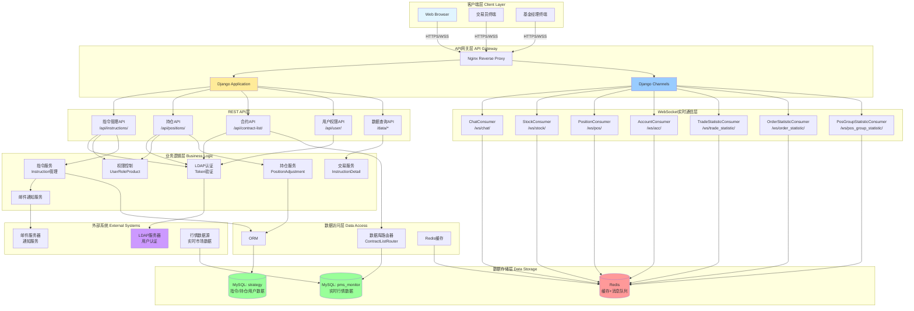
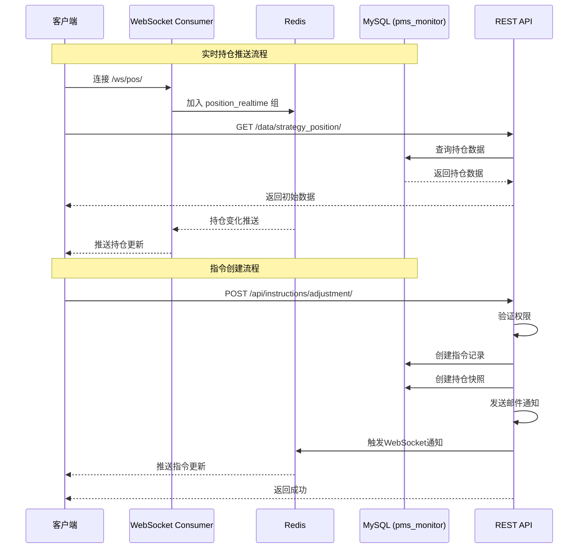
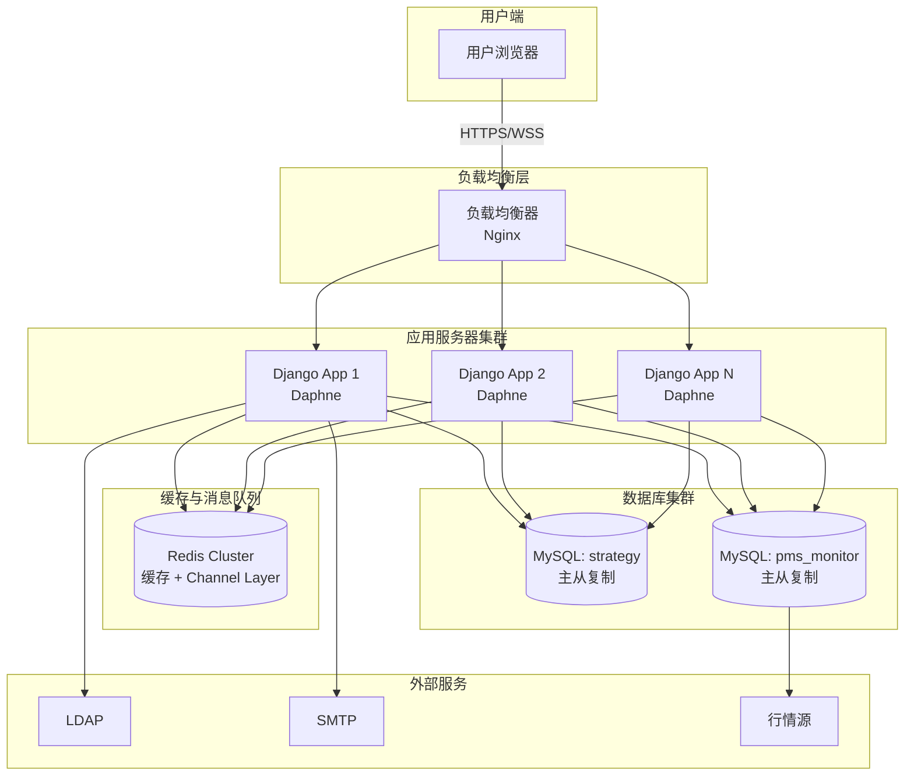
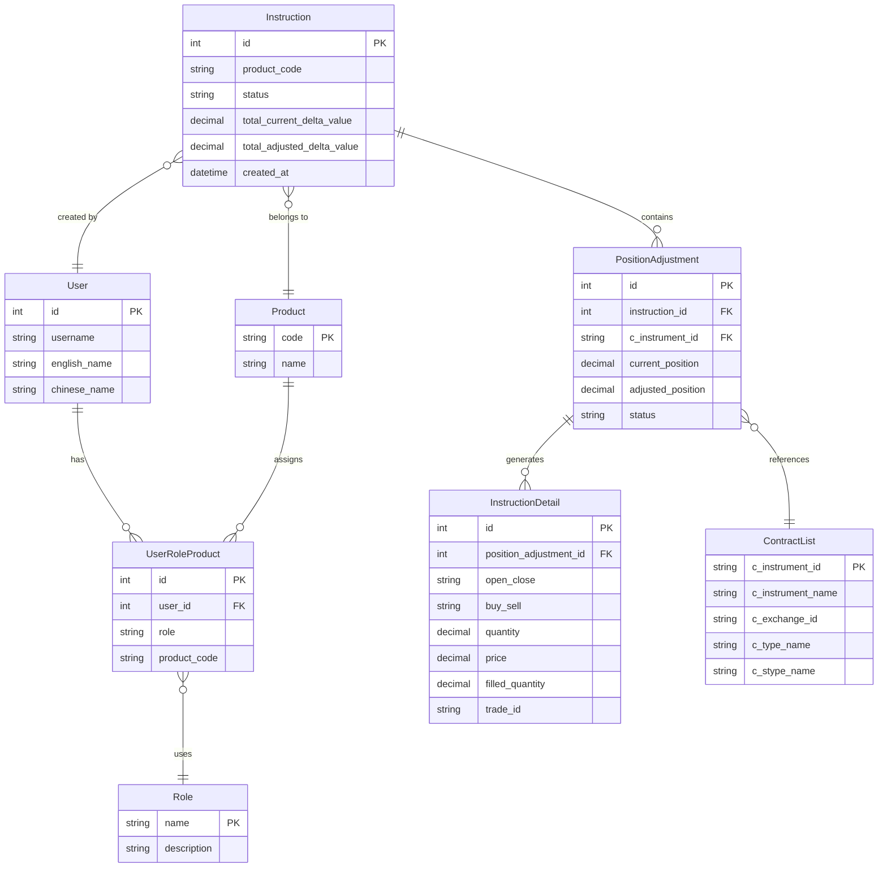

# 交易与行情监控系统架构图

## 系统架构图 (Mermaid)

## 数据流图

## 部署架构图

## 模块关系图

## WebSocket 端点说明

| 端点 | Consumer | 用途 | 数据类型 |
|------|----------|------|----------|
| `/hsapi/ws/chat/` | ChatConsumer | 团队聊天 | 文本消息 |
| `/hsapi/ws/stock/` | StockConsumer | 实时行情 | 行情数据 |
| `/hsapi/ws/pos/` | PositionConsumer | 持仓监控 | 持仓、Delta、市值 |
| `/hsapi/ws/acc/` | AccountConsumer | 账户监控 | 资金、风险指标 |
| `/hsapi/ws/trade_statistic/` | TradeStatisticConsumer | 成交统计 | 成交数据 |
| `/hsapi/ws/order_statistic/` | OrderStatisticConsumer | 委托统计 | 挂单数据 |
| `/hsapi/ws/pos_group_statistic/` | PosGroupStatisticConsumer | 持仓分组统计 | 分组持仓 |

## 核心API端点

### 指令管理
- `GET/POST /hsapi/wsapp/api/instructions/` - 指令列表/创建
- `GET /hsapi/wsapp/api/instructions/{id}/` - 指令详情
- `PUT /hsapi/wsapp/api/instructions/{id}/status/` - 更新状态
- `POST /hsapi/wsapp/api/instructions/adjustment/` - 创建调仓指令
- `GET /hsapi/wsapp/api/instructions/{id}/positions/` - 持仓明细

### 持仓与交易
- `POST /hsapi/wsapp/api/positions/` - 获取持仓数据
- `GET /hsapi/wsapp/api/trade-details/` - 待交易明细
- `PUT /hsapi/wsapp/api/positions/{id}/status/` - 更新持仓状态

### 合约管理
- `GET/POST /hsapi/wsapp/api/contract-list/` - 合约列表
- `GET /hsapi/wsapp/api/contract-list/{instrument_id}/` - 合约详情
- `GET /hsapi/wsapp/api/contracts/` - 需调整合约

### 数据查询
- `POST /hsapi/wsapp/data/strategy_position/` - 持仓数据
- `POST /hsapi/wsapp/data/strategy_account/` - 账户数据
- `POST /hsapi/wsapp/data/trade_statistic/` - 成交统计
- `POST /hsapi/wsapp/data/order_statistic/` - 委托统计
- `POST /hsapi/wsapp/data/all/` - 全部数据

## 数据库配置

### strategy 数据库 (默认)
- **主机**: 192.168.123.58
- **端口**: 3306
- **用途**: 指令、持仓、用户数据

### pms_monitor 数据库
- **主机**: 192.168.123.58
- **端口**: 3306
- **用途**: 实时行情数据 (只读)

### dataweb_read 数据库
- **主机**: 192.168.201.188
- **端口**: 3306
- **用途**: 用户管理数据 (只读)

## 系统特性

1. **实时性**: WebSocket推送确保数据实时更新
2. **可扩展性**: Redis Channel Layer支持横向扩展
3. **安全性**: LDAP认证 + 基于角色的权限控制
4. **高可用**: 数据库主从复制 + 应用集群部署
5. **性能优化**: Redis缓存减少数据库压力
